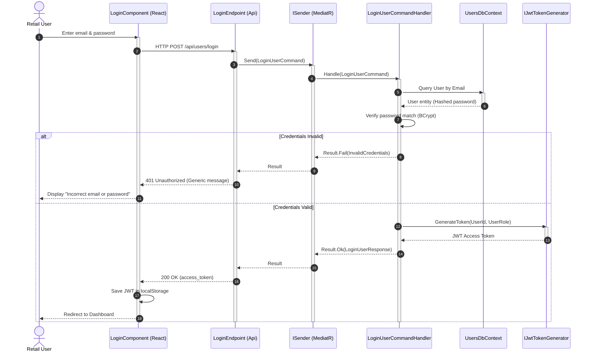
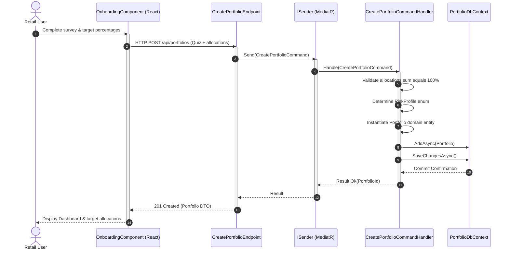
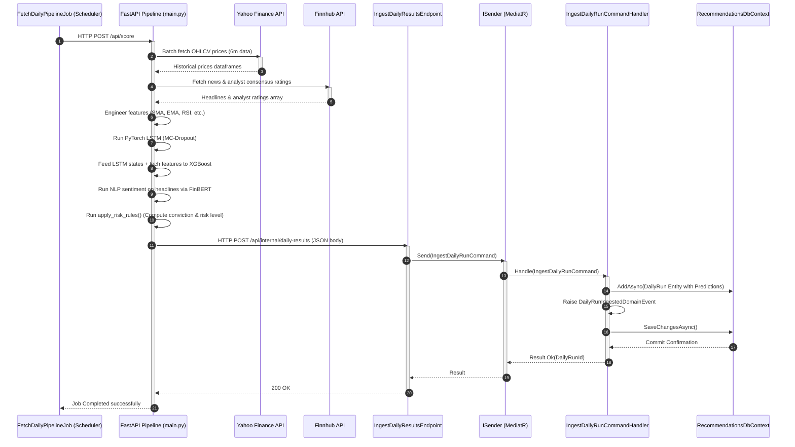
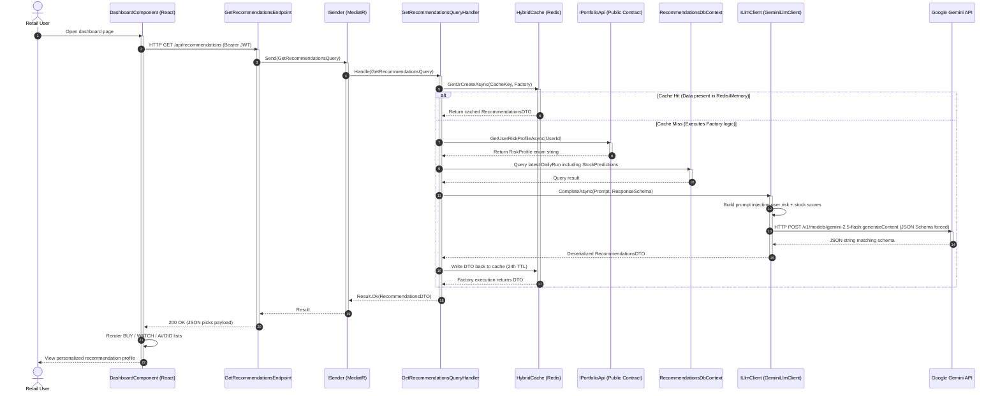

# System Sequence Diagrams

These sequence diagrams detail the key transactional and asynchronous event-driven flows across the **QuantWise** platform, using the actual classes and interfaces in the codebase and adhering to UML 2.5 standards.

---

## 1. User Registration Flow (CQRS & Transactional Outbox)
This flow models the registration process, demonstrating how a user's details are persisted and how a domain event is transactionally saved to the outbox for asynchronous cross-module notification.

```mermaid
sequenceDiagram
    autonumber
    actor User as Retail User
    participant UI as RegisterComponent (React)
    participant API as RegisterUserEndpoint (Api)
    participant Mediator as ISender (MediatR)
    participant Handler as CreateUserCommandHandler
    participant DB as UsersDbContext (EF Core)
    participant Outbox as OutboxMessages (Table)

    User->>UI: Submit form (email, password, etc)
    activate UI
    UI->>API: HTTP POST /api/users/register
    activate API
    API->>Mediator: Send(CreateUserCommand)
    activate Mediator
    Mediator->>Handler: Handle(CreateUserCommand)
    activate Handler

    Handler->>Handler: Hash password (BCrypt)

    rect rgb(18, 22, 27)
        note over Handler, DB: Atomic SQL Transaction
        Handler->>DB: AddAsync(New User Entity)
        Handler->>Handler: Raise UserCreatedDomainEvent
        Handler->>Outbox: AddAsync(UserCreatedDomainEvent JSON)
        Handler->>DB: SaveChangesAsync()
        DB-->>Handler: Commit Confirmation
    end

    Handler-->>Mediator: Result.Ok(UserId)
    deactivate Handler
    Mediator-->>API: Result
    deactivate Mediator
    API-->>UI: 201 Created (Location Header)
    deactivate API
    UI-->>User: Redirect to Onboarding
    deactivate UI
```

---

## 2. User Authentication & Session JWT Setup
Details credential checks and JWT authorization token generation.

---

## 3. Onboarding & Portfolio Allocation Target Setup
Models the onboarding process, illustrating how user survey questionnaires are converted into target asset allocations and saved.

---

## 4. Daily ML Scoring & Recommendation Ingestion (Nightly Clock)
Models the batch ingestion pipeline, illustrating the scheduler calling FastAPI to download data, run LSTM + XGBoost predictions, compute FinBERT sentiments, apply deterministic risk grading, and POST the results into the backend relational store.

---

## 5. Recommendations Retrieval & request-time Gemini Personalization
This is the core live retrieval logic: user visits dashboard → backend checks cache → on miss, calls Portfolio Module public API to fetch risk levels → queries latest DB run → passes both to Gemini to output risk-adherent allocation recommendations → caches results.

