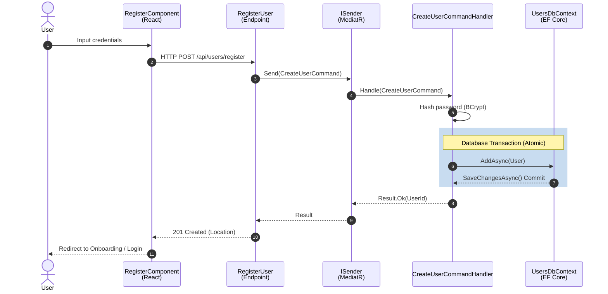
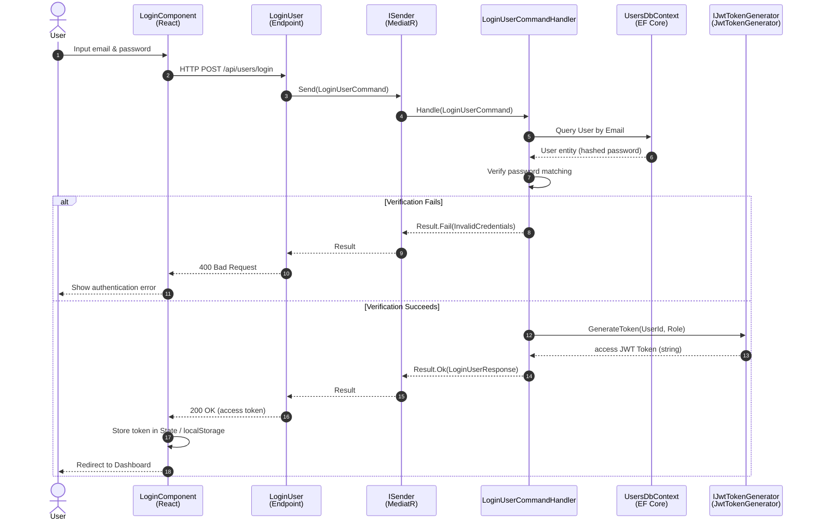
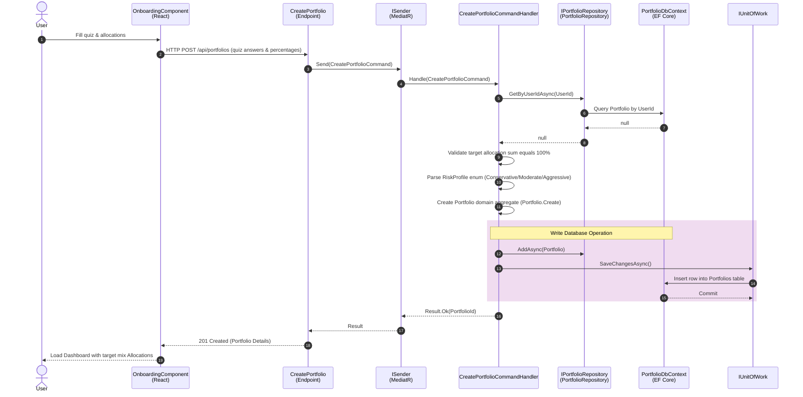
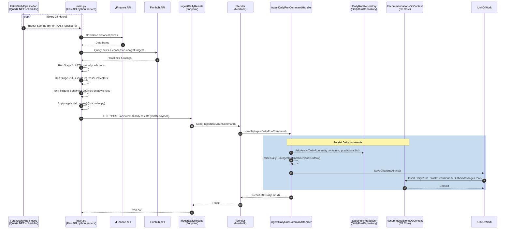
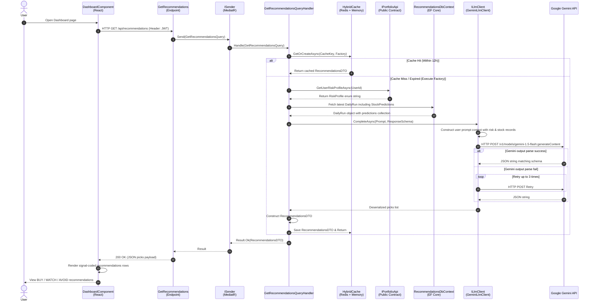

# System Sequence Diagrams

These sequence diagrams detail the key transactional and asynchronous event-driven flows across the **QuantWise** platform, using the actual classes and interfaces in the codebase.

---

## 1. User Registration Flow

This flow illustrates the user registration process, focusing on **CQRS** handlers and persistence in the database.

---

## 2. User Authentication & JWT Session Setup

---

## 3. Portfolio Creation & Onboarding Risk Profiling

This flow shows how the user submits their questionnaire answers and desired asset allocation target percentages to set up their portfolio.

---

## 4. Daily AI Batch Prediction & Ingest Pipeline

This flow explains how the background prediction service scrapes data, generates predictions, applies risk grading rules, and ingests the market-wide signals into the backend Recommendations database.

---

## 5. Get Recommendations (Request-Time Gemini Personalization Flow)

This sequence details what happens when a user loads their dashboard. The Recommendations module acts as the orchestrator, retrieving the user's risk profile from the Portfolio module, loading market-wide signals, calling Gemini, caching the response in Redis, and returning personalized picks.

