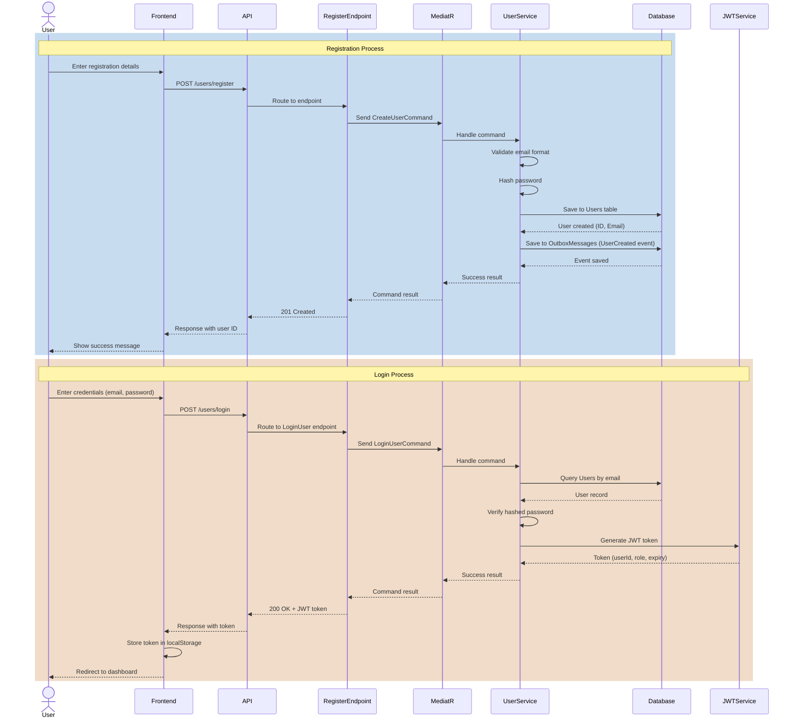
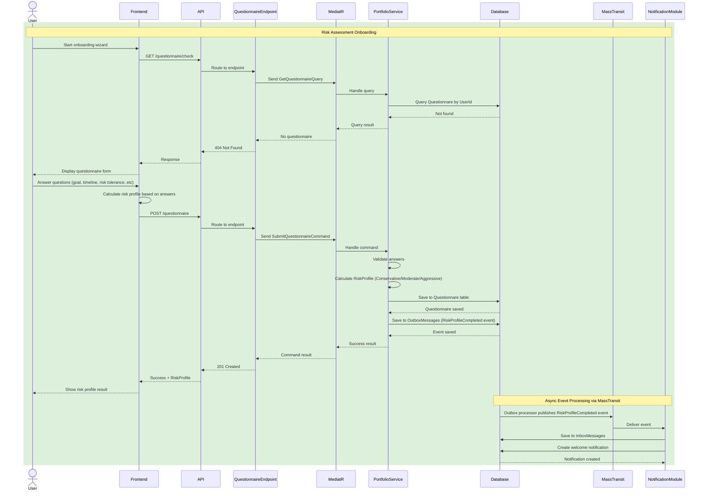
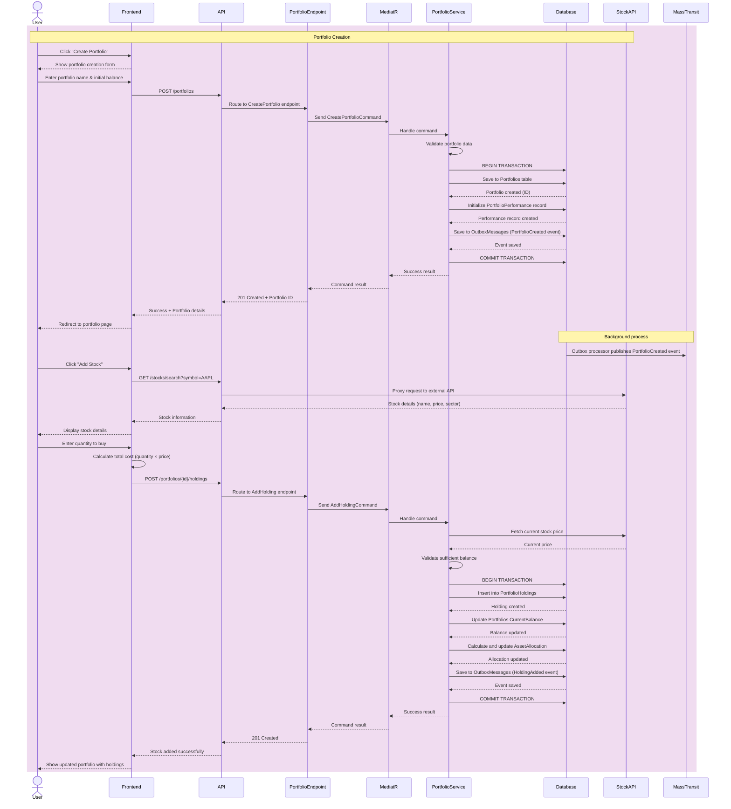

# Sequence Diagrams

## User Login and Onboarding Flow

### 1. User Registration and Login

### 2. Onboarding - Risk Questionnaire

### 3. Onboarding - Create First Portfolio

## Flow Summary

### Complete Onboarding Journey

1. **Registration** → User creates account, password is hashed and stored
2. **Login** → User authenticates, receives JWT token
3. **Risk Questionnaire** → User answers questions, system calculates risk profile
4. **Portfolio Creation** → User creates first portfolio with initial balance
5. **Add First Stock** → User searches and adds their first stock holding

### Key Architecture Patterns

- **Modular Monolith** - Single API hosting multiple business modules (Users, Portfolio, Notifications)
- **CQRS with MediatR** - Commands and queries separated using MediatR library
- **Minimal API Endpoints** - Each module exposes endpoints that route to MediatR handlers
- **Event-Driven** - Cross-module communication via MassTransit (RabbitMQ)
- **Outbox Pattern** - Events saved in same transaction as data, published asynchronously
- **Transaction Safety** - Database transactions ensure atomicity

### Key Security Features

- **Password Hashing** - Passwords never stored in plain text
- **JWT Authentication** - Token-based authentication for API requests
- **Input Validation** - All user inputs validated before processing
- **Balance Verification** - System checks sufficient funds before adding stocks
- **Authorization** - Endpoints require authentication via JWT

### Async Event Processing

- Events saved to OutboxMessages in same transaction as data
- Background jobs publish events to MassTransit/RabbitMQ
- Other modules consume events via InboxMessages pattern
- Ensures data consistency and reliable event delivery across modules

