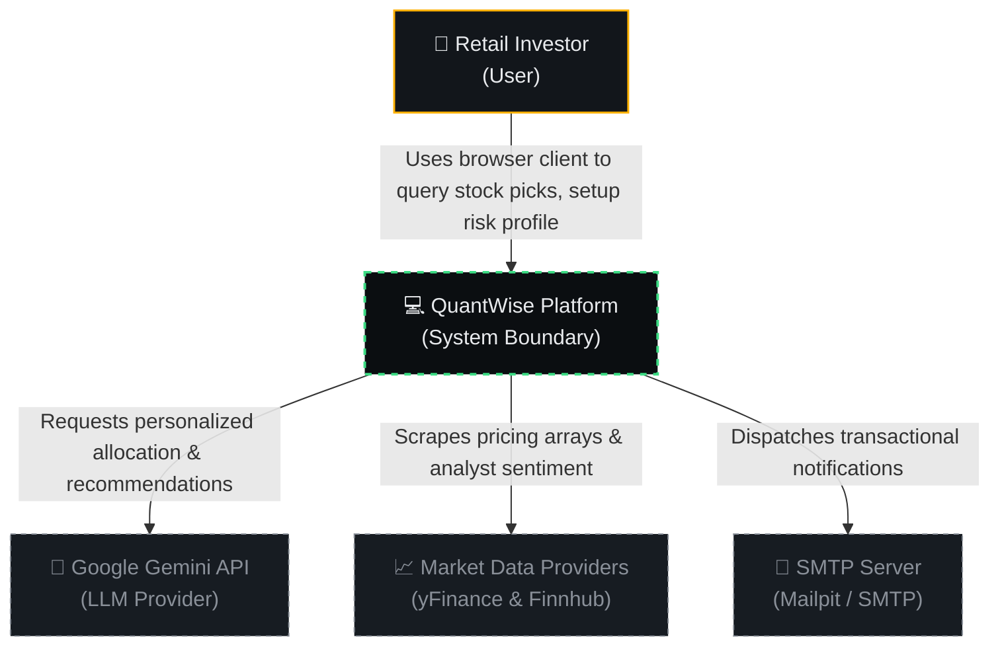
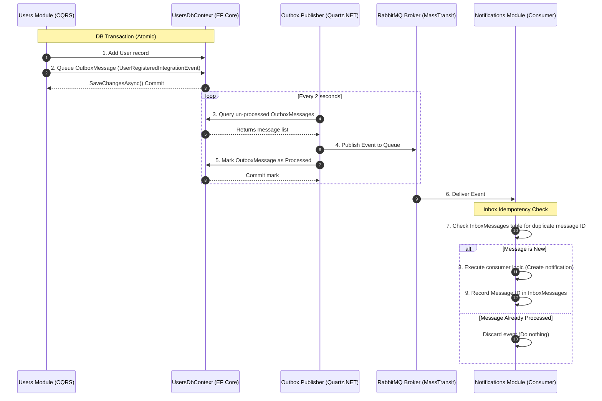

# System Architecture Document &bull; QuantWise

This document provides a comprehensive technical breakdown of the system architecture of the **QuantWise** platform, utilizing the industry-standard **C4 Model** (Context, Containers, and Components) to describe system boundaries, data pathways, and internal components.

---

## 1. Architectural Strategy: The Modular Monolith

QuantWise is built as a **Modular Monolith** in ASP.NET Core 10, combined with a separate **Python AI Pipeline** and a **React Frontend**. 

### Monolith vs. Microservices Comparison
* **Why not a traditional monolith?** A traditional monolith often deteriorates into a "big ball of mud" because there are no compilation boundaries preventing modules from directly querying other modules' databases or executing tight inter-class couplings.
* **Why not microservices?** Microservices introduce huge operational overhead (Kubernetes, service discovery, API gateways, Saga patterns for distributed transactions, and network latency) which is excessive for a small engineering team.
* **The Modular Monolith Sweet Spot:** QuantWise keeps all domain modules (**Users, Portfolio, Recommendations, Notifications**) inside a *single deployable application unit*, but enforces **strict logical separation**:
  1. Each module owns its folder namespace (`Modules/ModuleName/...`).
  2. Each module maintains its own isolated database tables and communicates with a **separate Entity Framework DbContext** (`UsersDbContext`, `PortfolioDbContext`, etc.).
  3. Direct database joins across modules are strictly forbidden. Cross-module operations happen either through **public interfaces** (via internal contract calls) or **asynchronously** via a transactional **Outbox/Inbox Pattern** using RabbitMQ.

---

## 2. C4 Level 1: System Context Diagram

The System Context diagram details how a user interacts with the QuantWise platform and how the system relies on external APIs (Google Gemini, yFinance, Finnhub).



---

## 3. C4 Level 2: Container Diagram

The Container diagram details the high-level services that make up the QuantWise platform, their tech stacks, and how they communicate.

```mermaid
flowchart TB
    subgraph Client["Client Layer"]
        Frontend["💻 React Frontend<br/>(React, TS, Vite)<br/>Interactive terminal dashboard"]
      end

    subgraph API["API Monolith (.NET 10)"]
        Gateway["⚡ ASP.NET Minimal API Gateway<br/>Unified gateway routing"]
        
        subgraph Modules["Monolith Domain Modules"]
            UsersMod["👤 Users Module"]
            PortfolioMod["💼 Portfolio Module"]
            RecsMod["🧠 Recommendations Module"]
            NotifMod["🔔 Notifications Module"]
        end
    end

    subgraph MessageQueue["Message Broker"]
        RabbitMQ["📨 RabbitMQ Bus<br/>(MassTransit Event Broker)"]
    end

    subgraph Data["Storage Layer"]
        PostgreSQL[("🐘 PostgreSQL 18 DB<br/>(Strictly Partitioned Tables)")]
        Redis[("⚡ Redis Cache Tier<br/>(Recommendations Cache)")]
    end

    subgraph AI["AI Pipeline Service"]
        FastAPI["🐍 FastAPI AI Service<br/>(Python Scikit/PyTorch/Transformers)"]
    end

    subgraph External["External APIs"]
        StockAPI["📈 yFinance & Finnhub"]
        GeminiAPI["🤖 Google Gemini API"]
    end

    %% Interactions
    Frontend <-->|HTTP REST & JWT Auth| Gateway
    Gateway --> UsersMod & PortfolioMod & RecsMod & NotifMod
    
    %% Database connections
    UsersMod & PortfolioMod & RecsMod & NotifMod -->|Isolated EF DbContexts| PostgreSQL
    RecsMod <-->|HybridCache 12h TTL| Redis
    
    %% Asynchronous communication via Outbox
    UsersMod & PortfolioMod & RecsMod -.->|Publish Outbox Events| RabbitMQ
    RabbitMQ -.->|Consume Inbox Events| NotifMod
    
    %% Internal Module Calls
    RecsMod -->|Fetch Risk Profile Contract| PortfolioMod

    %% AI Pipeline interactions
    FastAPI -->|1. Price scraping & sentiment| StockAPI
    FastAPI -->|2. Ingest daily run (HTTP POST)| Gateway
    RecsMod <-->|Request personalized LLM picks| GeminiAPI

    %% Styling
    classDef client fill:#0B1C24,stroke:#00B0FF,stroke-width:1.5px,color:#E8EAED;
    classDef gateway fill:#24190B,stroke:#FF9100,stroke-width:1.5px,color:#E8EAED;
    classDef module fill:#0B2414,stroke:#00E676,stroke-width:1.5px,color:#E8EAED;
    classDef storage fill:#240B24,stroke:#D500F9,stroke-width:1.5px,color:#E8EAED;
    classDef ai fill:#24240B,stroke:#FFEA00,stroke-width:1.5px,color:#E8EAED;
    classDef ext fill:#171C22,stroke:#8A9099,stroke-dasharray:4,color:#8A9099;

    class Frontend client;
    class Gateway gateway;
    class UsersMod,PortfolioMod,RecsMod,NotifMod module;
    class PostgreSQL,Redis,RabbitMQ storage;
    class FastAPI ai;
    class StockAPI,GeminiAPI ext;
```

---

## 4. Container Specifications & Responsibilities

| Container | Technology Stack | Responsibility | Key Classes / Files |
| :--- | :--- | :--- | :--- |
| **React Frontend** | React 18, TS, Vite, TanStack Query | Renders the "Quant Terminal" UI, manages authentication tokens (JWT), executes survey inputs, triggers dashboards. | [App.tsx](file:///d:/cs%20projects/Graduation-project/frontend/src/app/App.tsx) |
| **ASP.NET Core Gateway** | .NET 10, Minimal APIs, MediatR | Uniform ingress point. Directs incoming HTTP endpoints to their respective module handlers using CQRS. | [Program.cs](file:///d:/cs%20projects/Graduation-project/Backend/src/API/Project.Api/Program.cs) |
| **Users Module** | BCrypt, MediatR, EF Core | Handles registration, validation, credential verification, and JWT session creation. | [RegisterUserCommandHandler.cs](file:///d:/cs%20projects/Graduation-project/Backend/src/Modules/Users/Project.Modules.Users.Application/Users/Register/RegisterUserCommandHandler.cs) |
| **Portfolio Module** | DDD, FluentResults, EF Core | Computes user risk profiles (Conservative/Moderate/Aggressive), maintains portfolios, ETF allocations, and questionnaire survey answers. | [CreatePortfolioCommandHandler.cs](file:///d:/cs%20projects/Graduation-project/Backend/src/Modules/Portfolio/Project.Modules.Portfolio.Application/Portfolios/CreatePortfolio/CreatePortfolioCommandHandler.cs) |
| **Recommendations Module** | MediatR, Gemini SDK, HybridCache | Ingests daily raw AI predictions. Handles runtime requests by personalizing picks using Google Gemini and caching them. | [GetRecommendationsQueryHandler.cs](file:///d:/cs%20projects/Graduation-project/Backend/src/Modules/Recommendations/Project.Modules.Recommendations.Application/Recommendations/GetRecommendations/GetRecommendationsQueryHandler.cs) |
| **Notifications Module** | MassTransit, EF Core | Manages notification feeds and unread badges. Consumes events asynchronously. | [UserRegisteredIntegrationEventConsumer.cs](file:///d:/cs%20projects/Graduation-project/Backend/src/Modules/Notifications/Project.Modules.Notifications.Infrastructure/EventConsumers/UserRegisteredIntegrationEventConsumer.cs) |
| **PostgreSQL 18** | PostgreSQL, EF Core Migrations | Relational storage. Each module runs on its own isolated tables mapped to separate DbContexts. | [docker-compose.yml](file:///d:/cs%20projects/Graduation-project/docker-compose.yml) |
| **Redis Cache** | Redis 7, HybridCache | Caches personalized recommendations lists for 12 hours. Prevents redundant LLM token costs. | [docker-compose.yml](file:///d:/cs%20projects/Graduation-project/docker-compose.yml) |
| **RabbitMQ** | RabbitMQ, MassTransit | Asynchronous message broker delivering Integration Events across modules. | [docker-compose.yml](file:///d:/cs%20projects/Graduation-project/docker-compose.yml) |
| **FastAPI Service** | Python, FastAPI, PyTorch, XGBoost | Aggregates daily data, scores price trajectories, performs NLP news sentiment parsing. | [main.py](file:///d:/cs%20projects/Graduation-project/Pipeline/main.py) |

---

## 5. Event-Driven Reliability: Outbox & Inbox Patterns

To ensure high reliability, cross-module communication never uses direct database updates. Asynchronous event propagation utilizes the **Outbox Pattern** (to publish) and the **Inbox Pattern** (to consume) to guarantee **exactly-once processing** even during server crashes.



---

## 6. Daily Batch AI Pipeline & Personalization Flow

QuantWise partitions its machine learning and LLM tasks. Raw stock market predictions are **impersonal** and calculated **offline** in a daily batch. **Personalization** happens **online** at request time using Google Gemini.

```mermaid
flowchart TD
    subgraph OfflineBatch["Daily Offline Batch Pipeline (Python + Quartz)"]
        Trigger["Quartz.NET Trigger Job"] -->|HTTP POST /api/score| FastAPI["FastAPI Controller"]
        FastAPI -->|Scrape 6mo historical OHLCV| yFinance["yFinance API"]
        FastAPI -->|Download headlines & analyst reviews| Finnhub["Finnhub API"]
        
        yFinance -->|Prices| Stage1["Stage 1 Model: LSTM Backbone<br/>(Sequence Encoding & MC-Dropout)"]
        Finnhub -->|NLP Text| FinBERT["Sentiment Engine: FinBERT<br/>(HuggingFace Transformer)"]
        
        Stage1 -->|Temporal vectors & Uncertainty| Stage2["Stage 2 Model: XGBoost Head<br/>(Price Change Classifier)"]
        Stage2 & FinBERT -->|Scores| RiskRules["Risk Rules Validation<br/>(Conviction & Risk Flags)"]
        
        RiskRules -->|Daily predictions list| Ingest["HTTP Ingest Endpoint<br/>(.NET Web API)"]
        Ingest -->|Write to Recommendations schema| PG[(PostgreSQL)]
    end

    subgraph OnlineServing["Online Request-Time Personalization (.NET + Gemini)"]
        User["Retail Investor browser"] -->|GET /api/recommendations| APIGateway["ASP.NET API Gate"]
        APIGateway -->|Read cache| RedisCache{"Redis Cache Tier<br/>(Hit / Miss?)"}
        
        RedisCache -->|Cache Hit (Within 12h)| ReturnHit["Return RecommendationsDTO"] --> User
        
        RedisCache -->|Cache Miss| PortfolioService["1. Fetch User Risk Profile<br/>(Conservative/Moderate/Aggressive)"]
        PG -->|2. Fetch DailyRun stock predictions| RecommendationsService["Recommendations Module Handler"]
        
        PortfolioService & RecommendationsService -->|3. Compile Context Prompt| GeminiSDK["Google Gemini 1.5 Flash"]
        GeminiSDK -->|4. Structure-constrained output request| Gemini["Google Gemini API"]
        
        Gemini -->|5. Parsed valid JSON payload| CacheWrite["6. Save RecommendationsDTO to Redis"]
        CacheWrite --> ReturnMiss["Return RecommendationsDTO"] --> User
    end

    %% Styles
    classDef batch fill:#2A231C,stroke:#FFC107,stroke-width:1px,color:#E8EAED;
    classDef serve fill:#1F2A1C,stroke:#4CAF50,stroke-width:1px,color:#E8EAED;
    
    class Trigger,FastAPI,yFinance,Finnhub,Stage1,Stage2,FinBERT,RiskRules,Ingest,PG batch;
    class User,APIGateway,RedisCache,PortfolioService,RecommendationsService,GeminiSDK,Gemini,CacheWrite,ReturnHit,ReturnMiss serve;
```

### Detailed Prediction Metrics
1. **LSTM Backbone:** Processes a 60-day historical window with 5 engineered indicators (Return, Volume Ratio, RSI, MACD, MACD Histogram). Implements **Monte Carlo Dropout** (MC-Dropout) with 30 samplings to construct an uncertainty standard deviation.
2. **XGBoost Classifier:** Takes the LSTM hidden state plus 14 additional indicators (SMA/EMA ratios, momentum, volatility, Bollinger Bands) to output the price direction and magnitude.
3. **FinBERT News Sentiment:** Scores scraped headlines on a scale of `[-1, 1]` (Negative to Positive).
4. **Risk Rules Engine:** Cross-validates ML predictions against FinBERT sentiment. If they align, conviction is increased. If they conflict (e.g. LSTM predicts UP, but sentiment is NEGATIVE), a `signal_contradiction` flag is raised, dropping the overall conviction and raising the stock's risk grade.
5. **Google Gemini LLM:** Reads the curated stock signals and customizes selections according to the user's risk tier:
   * **Conservative:** Prefers Low-Risk, High-Conviction stocks. Targets lower allocations.
   * **Aggressive:** Allows Medium/High-Risk picks, targets concentrated higher allocations.
