# QuantWise UML Diagrams Portfolio

This document contains standard-compliant UML 2.5 diagrams for the **QuantWise** decision-support stock advisory platform. It covers the **Use Case Diagram**, **Class Diagram**, and **Sequence Diagrams** representing key system flows.

For maximum portability and tool support, every diagram is provided in two formats:
1. **PlantUML**: The industry-standard textual UML notation for enterprise software architecture tools.
2. **Mermaid**: Renders natively in modern Markdown viewers (like GitHub, GitLab, and IDE preview extensions).

---

## 1. Use Case Diagram

A UML Use Case Diagram maps the external actors, the system boundary, and the relationships (associations, generalizations, inclusions, and extensions) between use cases.

### UML Standards Applied
* **Actors**: Represented as stick figures (PlantUML) or clean boundary blocks (Mermaid). Primary actors are on the left; secondary system/API actors are on the right.
* **System Boundary**: A clearly defined rectangle grouping the internal modules of the QuantWise application, keeping actors external.
* **Relationships**:
  * **Association**: Solid lines connecting actors to use cases.
  * **Inclusion (`<<include>>`)**: Dashed arrows pointing from base use cases to included behaviors (e.g., retrieval requiring portfolio checks).
  * **Extension (`<<extend>>`)**: Dashed arrows pointing from extending features to the base use case.

### PlantUML Definition
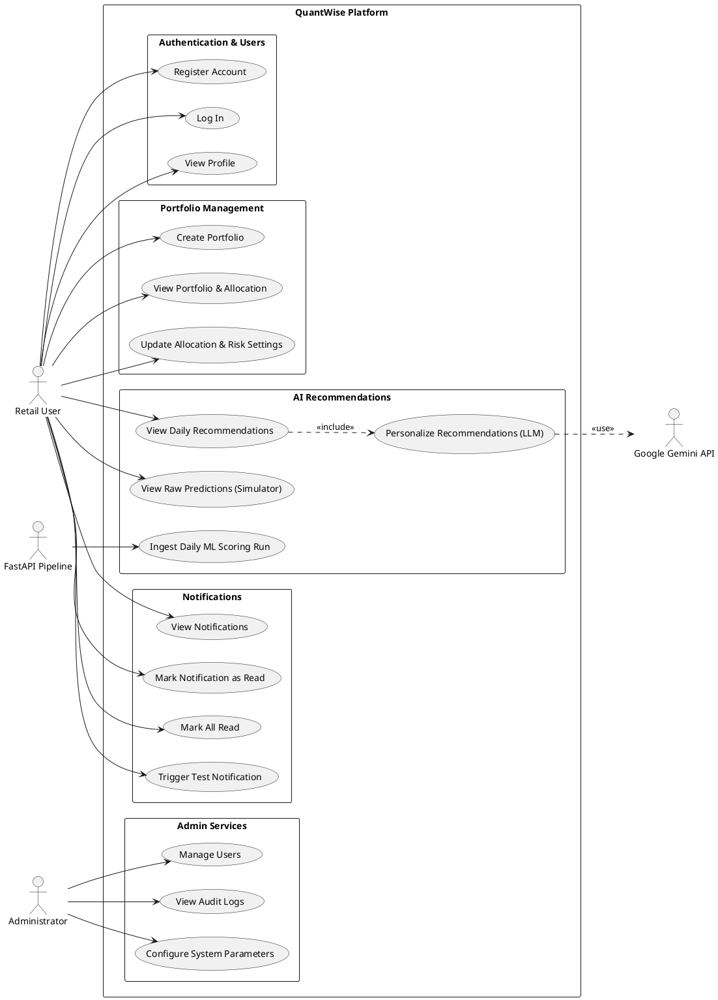

### Mermaid Flowchart Representation
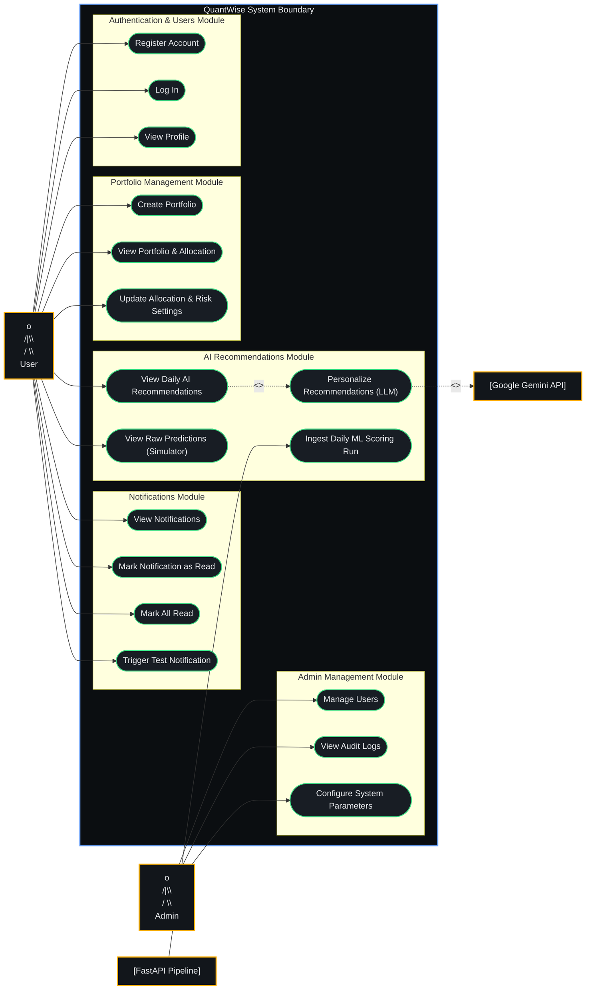

---

## 2. Class Diagram

The UML Class Diagram shows the system's static structure, detailing the classes, interfaces, attributes, operations (methods), and their design-time relationships.

### UML Standards Applied
* **Stereotypes**: Indicated via `<<stereotype>>` headers for specific class roles:
  * `«entity»`: Db-persisted domain models (deriving from the `Entity` base class).
  * `«aggregate-root»`: Parent entity coordinating consistency boundaries.
  * `«interface»`: Abstract operations.
  * `«handler»`: CQRS command or query handlers.
  * `«command»` / `«query»`: CQRS message payloads.
* **Access Modifiers**:
  * `+` Public
  * `-` Private
  * `#` Protected
* **Relationship Lines**:
  * `--|>` Generalization (Inheritance)
  * `..|>` Realization (Interface Implementation)
  * `*--` Composition (Aggregation where the part cannot exist without the whole)
  * `..>` Dependency (Usage relationship)

### PlantUML Definition
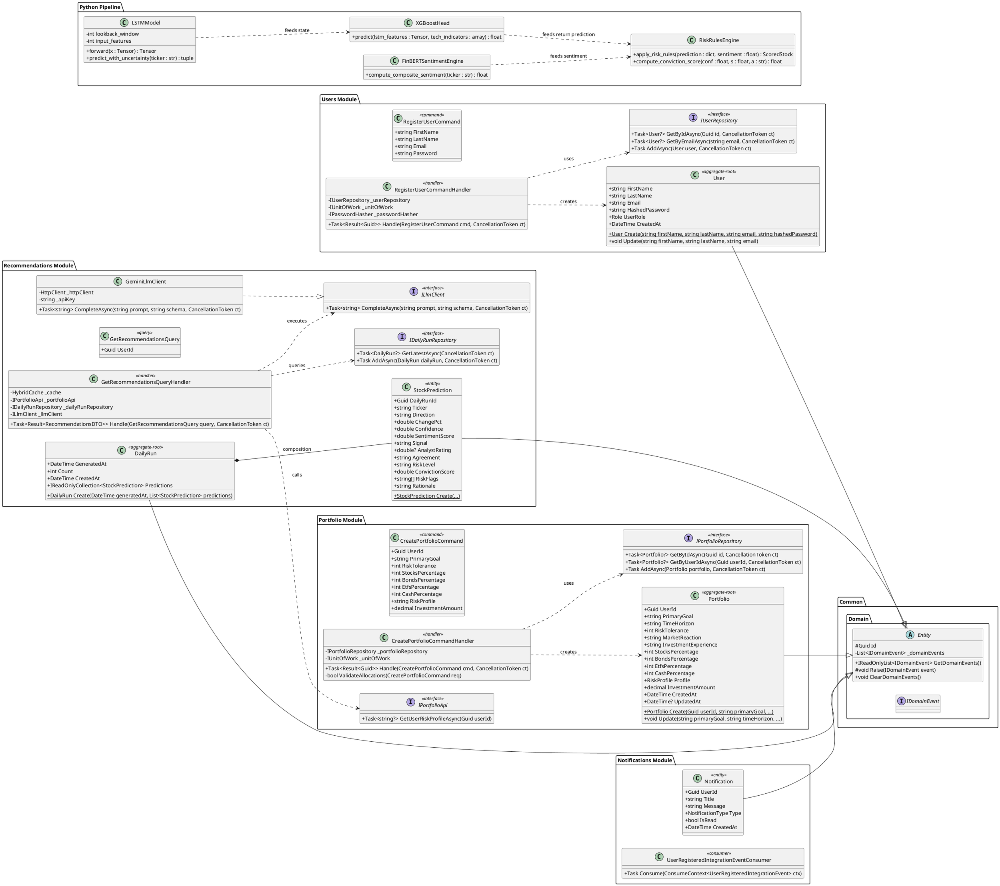

### Mermaid Class Diagram Representation
```mermaid
classDiagram
    %% Core Entities & Bases
    class Entity {
        <<abstract>>
        #Guid Id
        -List~IDomainEvent~ _domainEvents
        +GetDomainEvents() List~IDomainEvent~
        #Raise(event) void
        +ClearDomainEvents() void
    }

    class User {
        <<aggregate-root>>
        +string FirstName
        +string LastName
        +string Email
        +string HashedPassword
        +Role UserRole
        +DateTime CreatedAt
        +Create(firstName, lastName, email, hashedPassword) User$
        +Update(firstName, lastName, email) void
    }

    class Portfolio {
        <<aggregate-root>>
        +Guid UserId
        +string PrimaryGoal
        +string TimeHorizon
        +int RiskTolerance
        +string MarketReaction
        +string InvestmentExperience
        +int StocksPercentage
        +int BondsPercentage
        +int EtfsPercentage
        +int CashPercentage
        +RiskProfile Profile
        +decimal InvestmentAmount
        +DateTime CreatedAt
        +DateTime? UpdatedAt
        +Create(userId, primaryGoal, timeHorizon, ...) Portfolio$
        +Update(primaryGoal, timeHorizon, ...) void
    }

    class DailyRun {
        <<aggregate-root>>
        +DateTime GeneratedAt
        +int Count
        +DateTime CreatedAt
        +IReadOnlyCollection~StockPrediction~ Predictions
        +Create(generatedAt, predictions) DailyRun$
    }

    class StockPrediction {
        <<entity>>
        +Guid DailyRunId
        +string Ticker
        +string Direction
        +double ChangePct
        +double Confidence
        +double SentimentScore
        +string Signal
        +double? AnalystRating
        +string Agreement
        +string RiskLevel
        +double ConvictionScore
        +string[] RiskFlags
        +string Rationale
        +Create(ticker, direction, ...) StockPrediction$
    }

    class Notification {
        <<entity>>
        +Guid UserId
        +string Title
        +string Message
        +NotificationType Type
        +bool IsRead
        +DateTime CreatedAt
    }

    %% Interfaces
    class IPortfolioApi {
        <<interface>>
        +GetUserRiskProfileAsync(userId) Task~string~
    }

    class ILlmClient {
        <<interface>>
        +CompleteAsync(prompt, schema, ct) Task~string~
    }

    class GeminiLlmClient {
        -HttpClient _httpClient
        -string _apiKey
        +CompleteAsync(prompt, schema, ct) Task~string~
    }

    %% Python Pipeline Classes
    class LSTMModel {
        -int lookback_window
        -int input_features
        +forward(x) Tensor
        +predict_with_uncertainty(ticker) tuple
    }

    class XGBoostHead {
        +predict(lstm_features, tech_indicators) float
    }

    class FinBERTSentimentEngine {
        +compute_composite_sentiment(ticker) float
    }

    class RiskRulesEngine {
        +apply_risk_rules(prediction, sentiment) ScoredStock
        +compute_conviction_score(conf, s, a) float
    }

    %% Inheritance relationships
    User --|> Entity
    Portfolio --|> Entity
    DailyRun --|> Entity
    StockPrediction --|> Entity
    Notification --|> Entity

    %% Composition relationship (Stocks can't exist outside their Daily Run)
    DailyRun *-- StockPrediction : composition

    %% Realization
    GeminiLlmClient ..|> ILlmClient

    %% Dependencies
    LSTMModel ..> XGBoostHead : feeds state
    XGBoostHead ..> RiskRulesEngine : prediction
    FinBERTSentimentEngine ..> RiskRulesEngine : sentiment
```

---

## 3. Sequence Diagrams

UML Sequence Diagrams show object interactions arranged in time sequence. The following 5 diagrams cover the critical operational loops of QuantWise.

### UML Standards Applied
* **Lifelines**: Dashed lines dropping down from named participant boxes.
* **Focus of Control**: Activation bars (vertical boxes on lifelines) indicating that a process is active.
* **Message Arrows**:
  * Solid line, solid arrow (`->Block`) represents synchronous operations.
  * Solid line, open arrow (`->`) represents asynchronous signals.
  * Dashed line, open arrow (`-->>`) represents execution return value pathways.

---

### Flow 1: User Registration (CQRS & Transactional Outbox)
This flow models the registration process, demonstrating how a user's login details are persisted and how a domain event is transactionally saved to the outbox for asynchronous cross-module notification.

#### PlantUML
```plantuml
@startuml User Registration Flow
autonumber
actor User as "Retail User"
participant UI as "RegisterComponent (React)"
participant API as "RegisterUserEndpoint (Api)"
participant Mediator as "ISender (MediatR)"
participant Handler as "CreateUserCommandHandler"
database DB as "UsersDbContext (EF Core)"
database Outbox as "OutboxMessages (Table)"

User -> UI : Submit form (email, password, etc)
activate UI
UI -> API : HTTP POST /api/users/register
activate API
API -> Mediator : Send(CreateUserCommand)
activate Mediator
Mediator -> Handler : Handle(CreateUserCommand)
activate Handler

Handler -> Handler : Hash password (BCrypt)

note over Handler, DB, Outbox: Atomic SQL Transaction Start
Handler -> DB : AddAsync(New User Entity)
Handler -> Handler : Raise UserCreatedDomainEvent
Handler -> Outbox : AddAsync(UserCreatedDomainEvent JSON)
Handler -> DB : SaveChangesAsync()
DB --> Handler : Commit Confirmation
note over Handler, DB, Outbox: Atomic SQL Transaction End

Handler --> Mediator : Result.Ok(UserId)
deactivate Handler
Mediator --> API : Result
deactivate Mediator
API --> UI : 201 Created (Location Header)
deactivate API
UI --> User : Redirect to Onboarding
deactivate UI
@endum
```

#### Mermaid
```mermaid
sequenceDiagram
    autonumber
    actor User as Retail User
    participant UI as RegisterComponent (React)
    participant API as RegisterUserEndpoint (Api)
    participant Mediator as ISender (MediatR)
    participant Handler as CreateUserCommandHandler
    participant DB as UsersDbContext (EF Core)
    participant Outbox as OutboxMessages (Table)

    User->>UI: Submit form (email, password, etc)
    activate UI
    UI->>API: HTTP POST /api/users/register
    activate API
    API->>Mediator: Send(CreateUserCommand)
    activate Mediator
    Mediator->>Handler: Handle(CreateUserCommand)
    activate Handler

    Handler->>Handler: Hash password (BCrypt)

    rect rgb(18, 22, 27)
        note over Handler, DB: Atomic SQL Transaction
        Handler->>DB: AddAsync(New User Entity)
        Handler->>Handler: Raise UserCreatedDomainEvent
        Handler->>Outbox: AddAsync(UserCreatedDomainEvent JSON)
        Handler->>DB: SaveChangesAsync()
        DB-->>Handler: Commit Confirmation
    end

    Handler-->>Mediator: Result.Ok(UserId)
    deactivate Handler
    Mediator-->>API: Result
    deactivate Mediator
    API-->>UI: 201 Created (Location Header)
    deactivate API
    UI-->>User: Redirect to Onboarding
    deactivate UI
```

---

### Flow 2: User Authentication & Session JWT Setup
Details credential checks and JWT authorization token generation.

#### PlantUML
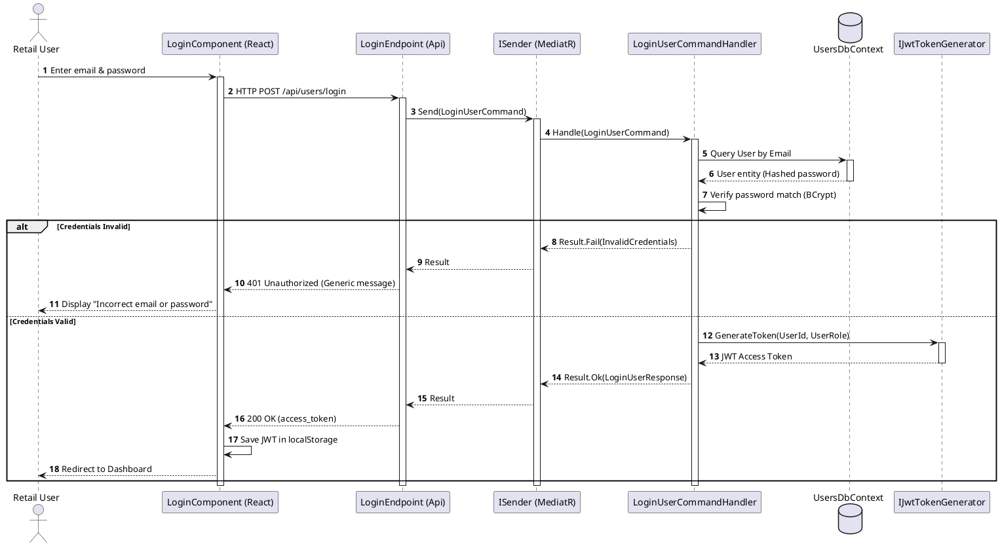

#### Mermaid
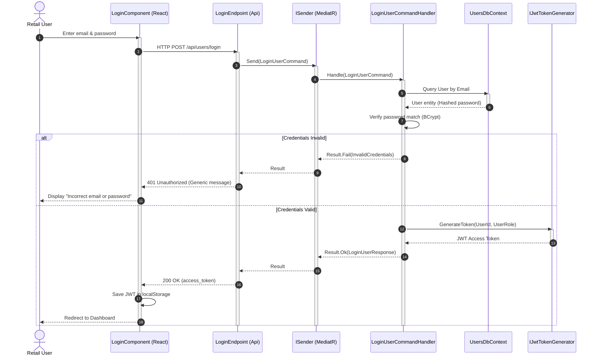

---

### Flow 3: Onboarding & Portfolio Allocation Target Setup
Models the onboarding process, illustrating how user questionnaires are converted into target asset allocations and saved.

#### PlantUML
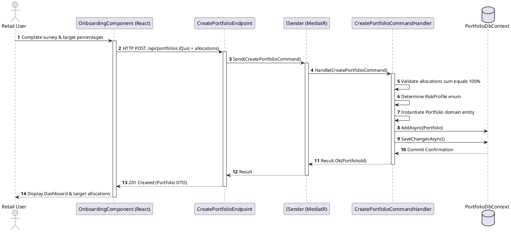

#### Mermaid
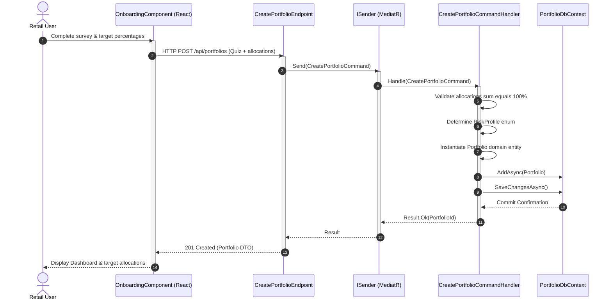

---

### Flow 4: Daily ML Scoring & Recommendation Ingestion (Nightly Clock)
Models the batch ingestion pipeline, illustrating the scheduler calling FastAPI to download data, run LSTM + XGBoost predictions, compute FinBERT sentiments, apply deterministic risk grading, and POST the results into the backend relational store.

#### PlantUML
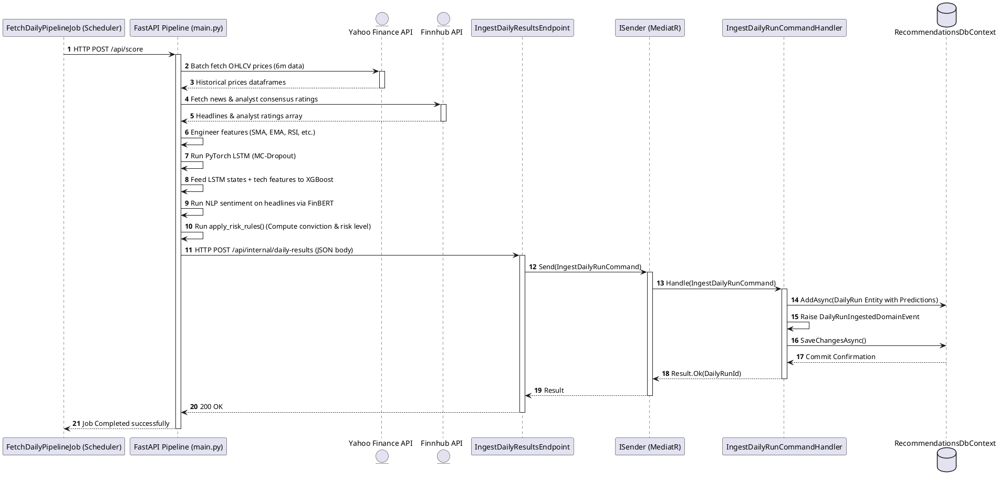

#### Mermaid
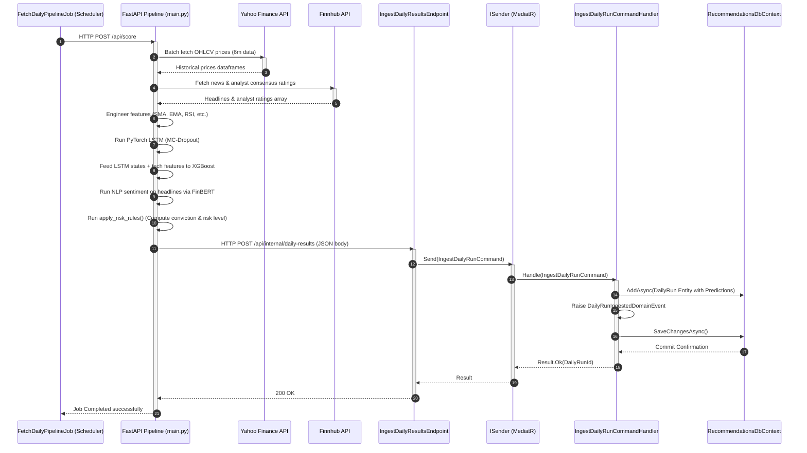

---

### Flow 5: Recommendations Fetching & request-time Gemini Personalization
This is the core live retrieval logic: user visits dashboard → backend checks cache → on miss, calls Portfolio Module public API to fetch risk levels → queries latest DB run → passes both to Gemini to output risk-adherent allocation recommendations → caches results.

#### PlantUML
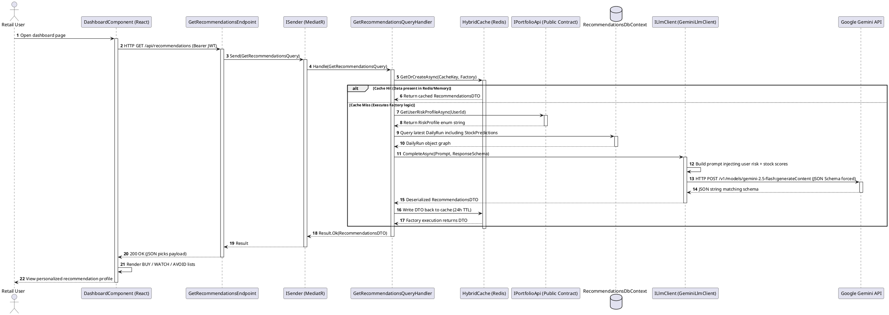

#### Mermaid
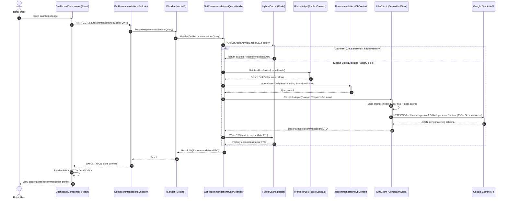

---

## 4. System Architecture Diagram (C4 Model Context & Container)

These C4 architecture diagrams map the high-level system boundaries, external integrations (Level 1 System Context), and internal application containers, communications, and database persistence layers (Level 2 Container Diagram).

### A. C4 Level 1: System Context Diagram
Deconstructs the platform boundaries, showing external systems (yFinance, Finnhub, Gemini API, Mailpit SMTP) interacting with QuantWise.

#### PlantUML Definition
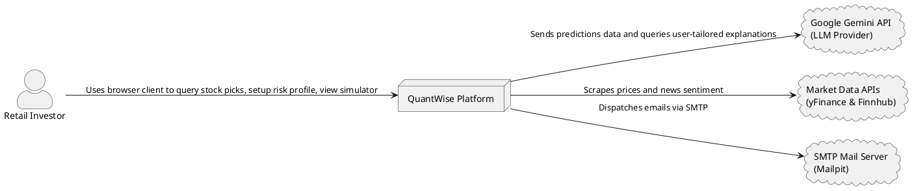

#### Mermaid Flowchart Representation
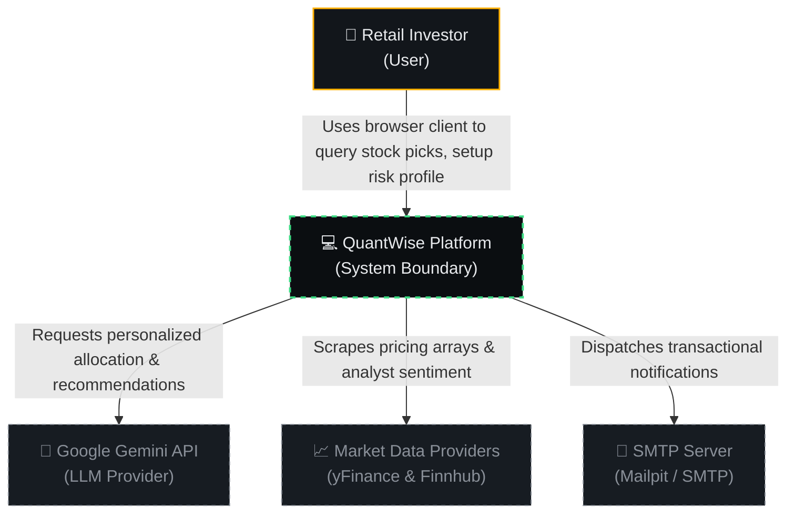

---

### B. C4 Level 2: Container Diagram
Details the internal modules, databases, pipeline runner, cache, and message queues that compose the modular-monolith and pipeline services.

#### PlantUML Definition
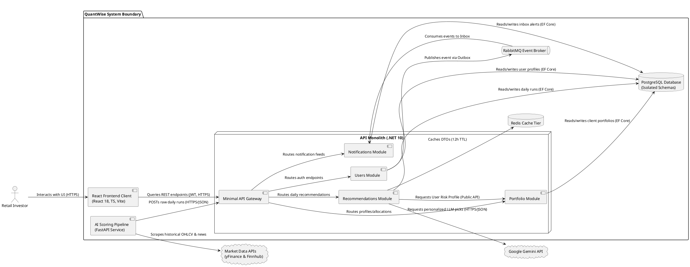

#### Mermaid Flowchart Representation
```mermaid
flowchart TB
    subgraph Client["Client Layer"]
        Frontend["💻 React Frontend\n(React, TS, Vite)\nInteractive terminal dashboard"]
      end

    subgraph API["API Monolith (.NET 10)"]
        Gateway["⚡ ASP.NET Minimal API Gateway\nUnified gateway routing"]
        
        subgraph Modules["Monolith Domain Modules"]
            UsersMod["👤 Users Module"]
            PortfolioMod["💼 Portfolio Module"]
            RecsMod["🧠 Recommendations Module"]
            NotifMod["🔔 Notifications Module"]
        end
    end

    subgraph MessageQueue["Message Broker"]
        RabbitMQ["📨 RabbitMQ Bus\n(MassTransit Event Broker)"]
    end

    subgraph Data["Storage Layer"]
        PostgreSQL[("🐘 PostgreSQL 18 DB\n(Strictly Partitioned Tables)")]
        Redis[("⚡ Redis Cache Tier\n(Recommendations Cache)")]
    end

    subgraph AI["AI Pipeline Service"]
        FastAPI["🐍 FastAPI AI Service\n(Python Scikit/PyTorch/Transformers)"]
    end

    subgraph External["External APIs"]
        StockAPI["📈 yFinance & Finnhub"]
        GeminiAPI["🤖 Google Gemini API"]
    end

    %% Interactions
    Frontend <-->|HTTP REST & JWT Auth| Gateway
    Gateway --> UsersMod
    Gateway --> PortfolioMod
    Gateway --> RecsMod
    Gateway --> NotifMod
    
    %% Database connections
    UsersMod -->|Isolated EF DbContexts| PostgreSQL
    PortfolioMod -->|Isolated EF DbContexts| PostgreSQL
    RecsMod -->|Isolated EF DbContexts| PostgreSQL
    NotifMod -->|Isolated EF DbContexts| PostgreSQL
    
    RecsMod <-->|HybridCache 12h TTL| Redis
    
    %% Asynchronous communication via Outbox
    UsersMod -.->|Publish Outbox Events| RabbitMQ
    PortfolioMod -.->|Publish Outbox Events| RabbitMQ
    RecsMod -.->|Publish Outbox Events| RabbitMQ
    RabbitMQ -.->|Consume Inbox Events| NotifMod
    
    %% Internal Module Calls
    RecsMod -->|Fetch Risk Profile Contract| PortfolioMod

    %% AI Pipeline interactions
    FastAPI -->|1. Price scraping & sentiment| StockAPI
    FastAPI -->|2. Ingest daily run (HTTP POST)| Gateway
    RecsMod <-->|Request personalized LLM picks| GeminiAPI

    %% Styling
    classDef client fill:#0B1C24,stroke:#00B0FF,stroke-width:1.5px,color:#E8EAED;
    classDef gateway fill:#24190B,stroke:#FF9100,stroke-width:1.5px,color:#E8EAED;
    classDef module fill:#0B2414,stroke:#00E676,stroke-width:1.5px,color:#E8EAED;
    classDef storage fill:#240B24,stroke:#D500F9,stroke-width:1.5px,color:#E8EAED;
    classDef ai fill:#24240B,stroke:#FFEA00,stroke-width:1.5px,color:#E8EAED;
    classDef ext fill:#171C22,stroke:#8A9099,stroke-dasharray:4,color:#8A9099;

    class Frontend client;
    class Gateway gateway;
    class UsersMod,PortfolioMod,RecsMod,NotifMod module;
    class PostgreSQL,Redis,RabbitMQ storage;
    class FastAPI ai;
    class StockAPI,GeminiAPI ext;
```
