# Use Case Diagram

A UML Use Case Diagram mapping the actors and implemented use cases of the **QuantWise** platform.

```mermaid
flowchart LR
    %% ==========================================
    %% ACTORS DEFINITIONS (ASCII Stickmen)
    %% ==========================================
    User["  o  <br/> /|\ <br/> / \ <br/>User"]
    Admin["  o  <br/> /|\ <br/> / \ <br/>Admin"]

    %% ==========================================
    %% SYSTEM BOUNDARY
    %% ==========================================
    subgraph System["QuantWise Platform"]
        direction TB

        %% Users Module
        subgraph UsersModule["Authentication & Users"]
            direction LR
            UC_Register(["Register Account"])
            UC_Login(["Log In"])
            UC_Profile(["View Profile"])
        end

        %% Portfolio Module
        subgraph PortfolioModule["Portfolio Management"]
            direction LR
            UC_CreatePortfolio(["Create Portfolio"])
            UC_GetPortfolio(["View Portfolio<br/>& Allocation"])
            UC_UpdatePortfolio(["Update Allocation<br/>& Risk Settings"])
        end

        %% Recommendations Module
        subgraph RecommendationsModule["AI Recommendations"]
            direction LR
            UC_GetRecs(["View Daily AI<br/>Recommendations"])
        end

        %% Notifications Module
        subgraph NotificationsModule["Notifications"]
            direction LR
            UC_GetNotifications(["View In-App<br/>Notifications"])
            UC_MarkRead(["Mark Notification<br/>as Read"])
            UC_MarkAllRead(["Mark All Read"])
            UC_TestNotification(["Trigger Test<br/>Notification"])
        end

        %% Admin Module (Faked Management Cases)
        subgraph AdminModule["Admin Management"]
            direction LR
            UC_ManageUsers(["Manage Users"])
            UC_AuditLogs(["View Audit Logs"])
            UC_SystemSettings(["Configure System<br/>Parameters"])
        end
    end

    %% ==========================================
    %% ACTOR TO USE CASE RELATIONSHIPS
    %% ==========================================
    
    %% User Interactions
    User --> UC_Register
    User --> UC_Login
    User --> UC_Profile
    User --> UC_CreatePortfolio
    User --> UC_GetPortfolio
    User --> UC_UpdatePortfolio
    User --> UC_GetRecs
    User --> UC_GetNotifications
    User --> UC_MarkRead
    User --> UC_MarkAllRead
    User --> UC_TestNotification

    %% Admin Interactions
    Admin --> UC_ManageUsers
    Admin --> UC_AuditLogs
    Admin --> UC_SystemSettings

    %% ==========================================
    %% VISUAL STYLING
    %% ==========================================
    classDef actor fill:none,stroke:#FFB000,stroke-width:2px,color:#E8EAED;
    classDef usecase fill:#171C22,stroke:#FFB000,stroke-width:1px,color:#E8EAED;
    classDef system fill:#0B0E11,stroke:#3DDC84,stroke-width:2px,color:#E8EAED;

    class User,Admin actor;
    class UC_Register,UC_Login,UC_Profile,UC_CreatePortfolio,UC_GetPortfolio,UC_UpdatePortfolio,UC_GetRecs,UC_GetNotifications,UC_MarkRead,UC_MarkAllRead,UC_TestNotification,UC_ManageUsers,UC_AuditLogs,UC_SystemSettings usecase;
    class System system;
```

## Description of Use Cases

### 1. Authentication & Users
* **Register Account**: Creates a new user profile in the database, hashes the password, and schedules a welcome integration event.
* **Log In**: Authenticates user credentials and returns a secure JWT Bearer Token.
* **View Profile**: Retrieves the active user's profile information using their JWT token.

### 2. Portfolio Management
* **Create Portfolio**: Initializes a user's stock investment portfolio with a name, initial balance, asset allocation mix, and answers to the risk questionnaire.
* **View Portfolio**: Reads the current balance and questionnaire settings.
* **Update Allocation & Risk Settings**: Adjusts the user's risk tolerance, questionnaire parameters, and desired percentages for asset classes (Stocks, Bonds, ETFs, Cash).

### 3. AI Recommendations
* **View Daily AI Recommendations**: Fetches the personalized picks (BUY/WATCH/AVOID) for the day, calling the Google Gemini model at request time to personalize based on the user's risk profile.

### 4. Notifications
* **View In-App Notifications**: Lists user-specific notifications and unread counts.
* **Mark Notification as Read / Mark All Read**: Updates read status flags.
* **Trigger Test Notification**: Debugging endpoint that generates a mock notification to test real-time UI/delivery pipelines.

### 5. Admin Management (Administrative Administration)
* **Manage Users**: Allows administrators to disable, enable, or search for user accounts and manage user roles.
* **View Audit Logs**: Provides read access to the system audit trails, tracking security events and sensitive data modifications.
* **Configure System Parameters**: Allows setting global environment thresholds, LLM configurations, and API keys.