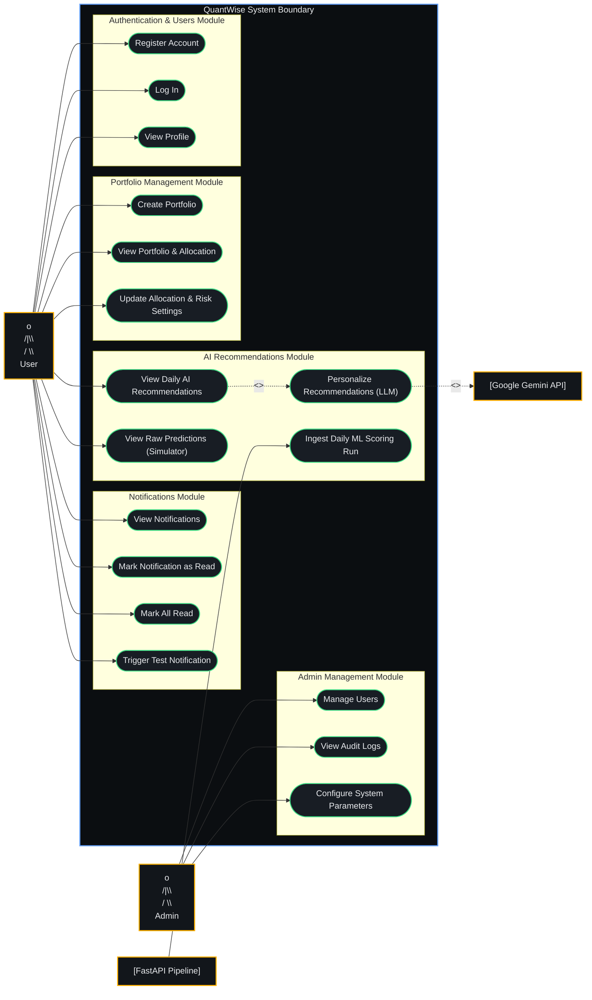

# Use Case Diagram

A UML Use Case Diagram mapping the actors, system boundary, and implemented use cases of the **QuantWise** platform, adhering strictly to UML 2.5 standards.

## Diagram

---

## Description of Actors & Use Cases

### Actors
* **Retail User (Primary Actor)**: Individual investor utilizing the platform to onboarding, construct portfolios, and obtain daily risk-tailored buy/sell advisory.
* **Administrator (Primary Actor)**: Backend manager handling user accounts, system configuration thresholds, and reviewing operational logs.
* **FastAPI Pipeline (System Actor)**: Background ML processing system that executes price time-series scoring, sentiment NLP, and risk grading, pushing daily results to the API.
* **Google Gemini API (System Actor)**: External generative language model serving as a constrained synthesizer to personalize output text signals based on user-specific portfolio criteria.

### 1. Authentication & Users
* **Register Account**: Initiates a new user profile, hashes passwords via BCrypt, and schedules a welcome integration event.
* **Log In**: Authenticates credentials and issues a secure JWT Bearer token.
* **View Profile**: Queries user details via active token context.

### 2. Portfolio Management
* **Create Portfolio**: Onboards user through a risk questionnaire to compute and set up initial asset target allocation percentages.
* **View Portfolio & Allocation**: Reads asset target mix percentages and total investment values.
* **Update Allocation & Risk Settings**: Modifies risk tolerance profiles and target asset class allocation settings.

### 3. AI Recommendations
* **View Daily AI Recommendations**: Reads risk-tailored recommendation picks. **Includes** `Personalize Recommendations (LLM)` on a cache miss.
* **Personalize Recommendations (LLM)**: Integrates current market predictions with the user's specific risk settings via Gemini. **Uses** `Google Gemini API` as a supporting system service.
* **View Raw Predictions (Simulator)**: Exposes the full market-wide daily pipeline outputs to allow users to run simulations in the learning terminal.
* **Ingest Daily ML Scoring Run**: Receives incoming batch runs from the Python pipeline, persists database entities, and triggers domain fanning out.

### 4. Notifications
* **View Notifications**: Fetches user-specific inbox alerts.
* **Mark Notification as Read / Mark All Read**: Updates target notification status properties.
* **Trigger Test Notification**: Internal testing helper to verify transactional notification flows.

### 5. Admin Management
* **Manage Users**: Review, disable, or modify user profile scopes.
* **View Audit Logs**: Inspect system activity and database logs.
* **Configure System Parameters**: Fine-tune global threshold variables.