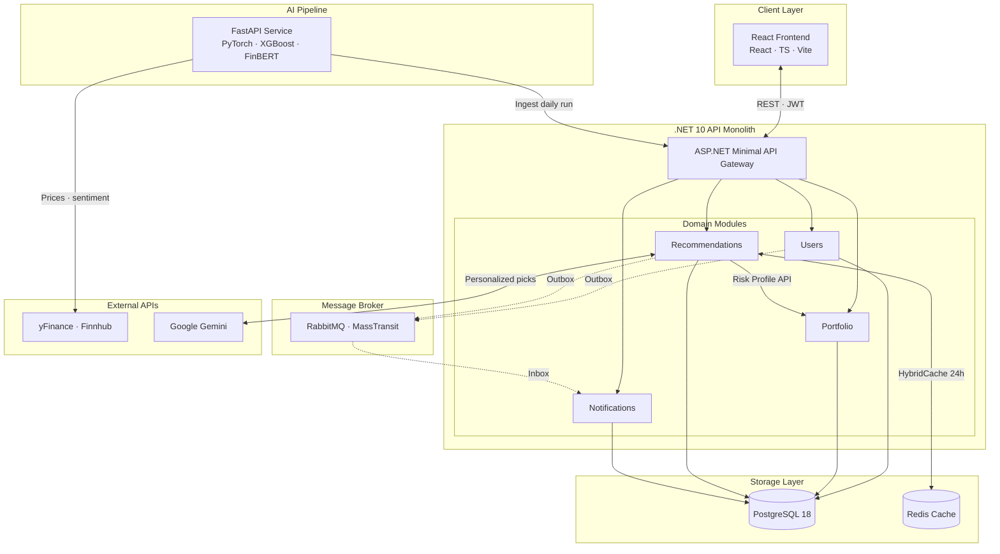
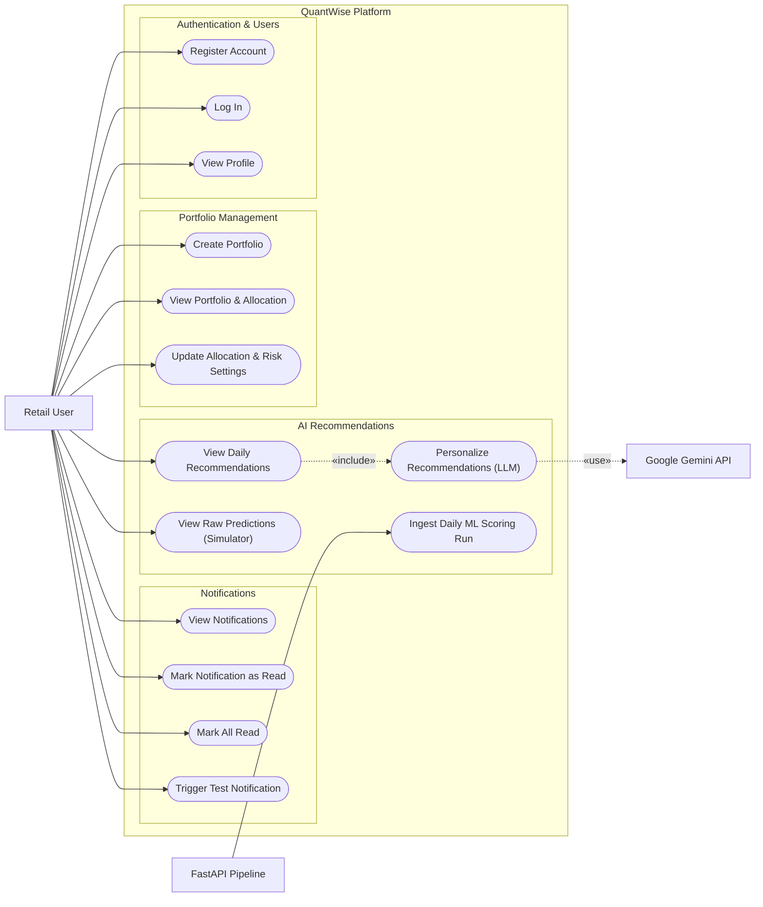

```plantuml
@startgantt fig-3-2-gantt
' QuantWise — Figure 3.2 Project Schedule (Gantt)
' Kanban flow framed across milestones M0-M4, Feb-Jun 2026.
' The offline ML-training phase overlaps the inter-semester gap and was done first.
project starts 2026-02-01

[M0 Offline ML training (LSTM/XGBoost/FinBERT, risk rules)] as [M0] lasts 56 days
[M1 Backend foundation (modular monolith, Users + Portfolio, outbox/inbox)] as [M1] lasts 28 days
[M2 Pipeline service + ingest (FastAPI /api/score, Recommendations, Quartz)] as [M2] lasts 21 days
[M3 Recommendations + frontend (Gemini, 24h cache, fan-out, Quant Terminal)] as [M3] lasts 21 days
[M4 Testing, hardening + write-up (68 tests, coverage, perf, security)] as [M4] lasts 24 days

[M1] starts at [M0]'s end
[M2] starts at [M1]'s end
[M3] starts at [M2]'s end
[M4] starts at [M3]'s end

@endgantt
```

  <header class="cover-logos">
    

      
      
    

    
  </header>

  <main class="cover-main">
    
Graduation Project · 2025 / 2026

    <h1 class="title">QuantWise</h1>
    
An AI-Powered Decision-Support Stock Advisory Platform

    
Personalised, Risk-Graded Investment Recommendations for Retail Investors

  </main>

  <footer class="cover-footer">
    

      

        Team
        
<strong>Seif ElDein Mostafa</strong>235057 · SE

        
<strong>Yahia Ahmed</strong>235161 · SE

      

      

        Supervision
        
<strong>Dr. Marwa Solayman</strong>Supervisor

        
<strong>Eng. Farah Darwish</strong>TA Supervisor

      

    

    

      Aligned SDGs
      

        <b>9</b>Industry, Innovation &amp; Infrastructure
        <b>10</b>Reduced Inequalities
      

    

  </footer>

---
layout: default
---

  
Introduction · 1 / 3

  <h1 class="qw-title">Background</h1>

  
Commission-free apps — Robinhood, eToro, and Egypt's Thndr — have put the stock market in everyone's pocket. The knowledge to use it well did not arrive with them.

  

    

      
~23%

      
of US equity trading volume is now retail — up from under 15% in 2019

    

    

      
&gt;30%

      
growth in US retail brokerage accounts between 2019 and 2022

    

  

  

    
01<b>The domain.</b> Decision-support investing — turning prices, forecasts, news sentiment, and risk profiling into a clear "what should I do?" — <em>not</em> automated trading.

    
02<b>The gap.</b> That guidance traditionally needs financial expertise or costly advisory services most first-time investors cannot reach.

    
03<b>The result.</b> New investors face information overload and fall back on generic robo-advice or guesswork — leading to avoidable losses.

  

  
Sources: FINRA — growth in U.S. retail brokerage participation (2019–2022); Bloomberg Intelligence — retail share of U.S. equity trading volume (2023).

---
layout: default
---

  
Introduction · 2 / 3

  <h1 class="qw-title">Motivation</h1>

  <blockquote class="qw-quote">"As a Thndr user, I watched friends download the app — then freeze. They had the account, but no idea what to buy or how to start."</blockquote>

  
That gap is the reason QuantWise exists: to guide everyday retail investors who know nothing about the market toward safe, informed entry.

  

    

      
Leaving it in the bank

      
Returns below inflation

      
Savings interest often fails to beat the yearly inflation rate — real money quietly loses value over time.

    

    

      
Low-risk equity investing

      
Safer than it looks — higher real returns

      
Diversified, risk-graded stock exposure has historically outpaced bank savings, with risk kept deliberately low.

    

  

---
layout: default
---

  
Introduction · 3 / 3

  <h1 class="qw-title">Challenges</h1>

  
Four limitations stood out across the research — and became the problems QuantWise set out to tackle.

  

    

      <h3>Quant forecasts alone</h3>
      
Deep-learning and tree models predict price direction well, but carry no sentiment, no risk grading, and no personalization.

      
→ Pair forecasts with sentiment + a risk engine

    

    

      <h3>Sentiment-only models</h3>
      
Improve signal reliability, yet don't produce equity-level, explainable, per-user recommendations.

      
→ Fuse sentiment into one graded signal

    

    

      <h3>Ungrounded LLMs</h3>
      
Generative models can read markets from text, but hallucinate — unsafe for direct financial advice.

      
→ Constrain the LLM to pre-validated signals

    

    

      <h3>Generic robo-advisors</h3>
      
Personalize only at the asset-class level: no per-stock calls, no rationale, static between rebalances.

      
→ Per-stock, risk-personalized, explained picks

    

  

  
Research basis: Fischer &amp; Krauss (2018); Araci — FinBERT (2019); Lopez-Lira &amp; Tang (2023); Betterment / Wealthfront robo-advisory.

---
layout: default
---

  
Problem Statement

  <h1 class="qw-title">The questions we set out to answer</h1>

  
Non-expert retail investors lack guidance that is at once personalised, risk-aware, grounded, and interpretable. We frame that gap as four questions — each with the improvement QuantWise targets.

  

    

      
Q1

      
How can market-wide ML forecasts become per-user, risk-graded picks a beginner can act on at a glance?

      
↓ Decision time

    

    

      
Q2

      
Can a generative LLM personalise advice without inventing prices, tickers, or numbers?

      
↑ Reliability

    

    

      
Q3

      
Can quantitative predictions and market sentiment be fused into one trustworthy signal?

      
↑ Accuracy

    

    

      
Q4

      
Can personalised AI advice be served instantly and cost-effectively, every trading day?

      
↓ Latency &amp; cost

    

  

---
layout: default
---

  
Objective

  <h1 class="qw-title">What QuantWise sets out to achieve</h1>

  
Make professional-grade, <b>risk-aware investing</b> genuinely accessible — so anyone can start with confidence, regardless of their financial background.

  

    

      ◆
      

        <h4>Personalised plans</h4>
        
A BUY / SELL / HOLD plan with allocations and plain-language reasons, tailored to each user's risk profile.

      

    

    

      ◆
      

        <h4>Trustworthy AI</h4>
        
Advice users can rely on — the model only synthesises validated signals; it never forecasts or invents numbers.

      

    

    

      ◆
      

        <h4>Clarity over noise</h4>
        
Turn a daily flood of prices, news, and signals into one confident decision in seconds.

      

    

    

      ◆
      

        <h4>Investing for everyone</h4>
        
Help first-time investors beat inflation safely and close the gap with institutional players (SDG 9 &amp; 10).

      

    

  

---
layout: default
---

  
Related Work · 1 / 3 — Prediction

  <h1 class="qw-title">LSTM for financial market prediction</h1>
  
Fischer &amp; Krauss · European Journal of Operational Research · 2018

  

    

      Model
      
A Long Short-Term Memory (LSTM) recurrent neural network — a deep sequence model with gated memory cells for time-series.

    

    

      Architecture
      
Trained on the full S&amp;P 500 constituent history; sequences of past returns feed the LSTM to predict which stocks beat the cross-sectional median next day.

    

    

      Results
      
+0.46% / dayDaily returns of ~0.46% before costs (Sharpe ≈ 5.8), outperforming random forests, deep nets, and logistic regression.

    

    

      Limitation
      
Uses price data only — no news sentiment — and the excess returns decay after 2010 as markets grow more efficient.

      
→ QuantWise fuses sentiment + risk grading onto the forecast.

    

  

  
Fischer, T. &amp; Krauss, C. (2018). Deep learning with long short-term memory networks for financial market predictions. European Journal of Operational Research, 270(2), 654–669.

---
layout: default
---

  
Related Work · 2 / 3 — Sentiment

  <h1 class="qw-title">FinBERT: domain-tuned financial sentiment</h1>
  
Araci · arXiv:1908.10063 · 2019

  

    

      Model
      
BERT — a transformer language model — further pre-trained on a large financial-news corpus, then fine-tuned for sentiment.

    

    

      Architecture
      
Stacked self-attention encoders produce context-aware embeddings; a classification head labels financial text as positive / negative / neutral.

    

    

      Results
      
0.86 accuracyState of the art on the Financial PhraseBank, beating prior lexicon and ML methods even with little labelled data.

    

    

      Limitation
      
Classifies sentiment only — it says nothing about price direction or magnitude, so a positive headline can contradict a falling forecast.

      
→ QuantWise cross-validates FinBERT against the quant signal.

    

  

  
Araci, D. T. (2019). FinBERT: Financial Sentiment Analysis with Pre-trained Language Models. arXiv:1908.10063. QuantWise uses the ProsusAI/finbert implementation.

---
layout: default
---

  
Related Work · 3 / 3 — Personalization

  <h1 class="qw-title">LLMs forecasting from financial news</h1>
  
Lopez-Lira &amp; Tang · arXiv:2304.07619 · 2023

  

    

      Model
      
A large language model (ChatGPT / GPT-class) prompted to read news headlines and rate their sentiment for a stock.

    

    

      Architecture
      
Zero-shot prompting: each headline becomes an LLM sentiment score, aggregated into a daily signal used to rank stocks long/short.

    

    

      Results
      
Significant αLLM news sentiment showed statistically significant predictive power for next-day returns; the long–short strategy was profitable.

    

    

      Limitation
      
The model reasons about markets ungrounded — it can hallucinate, carries no user risk profile, and isn't anchored to validated signals.

      
→ QuantWise constrains the LLM to synthesise pre-graded signals only.

    

  

  
Lopez-Lira, A. &amp; Tang, Y. (2023). Can ChatGPT Forecast Stock Price Movements? Return Predictability and Large Language Models. arXiv:2304.07619.

---
layout: default
---

  
Dataset · 1 / 2 — Published Paper

  <h1 class="qw-title">14 US equities · 2010 – 2017</h1>

  

    
TaskRegression

    
OutputContinuous return → up / down

    
ModalityNumerical time-series

    
GranularityDaily OHLCV

  

  

    

      Features
      

        
One trading day per stock is a record. Raw <b>Open-High-Low-Close-Volume</b> prices feed <b>14 hand-crafted technical indicators</b> (RSI, MACD, SMA/EMA ratios, momentum, volatility).

        
The LSTM reads a <b>60-day window</b>; its embedding is stacked with the indicators into a <b>78-feature</b> vector for the XGBoost head.

        
Target — forward return at 30 / 90 / 252 / 365-day horizons (continuous; direction derived as a binary up/down label). Not a classification dataset.

      

    

    

      Sample — AAPL, daily OHLCV · 2017
      <table class="qw-ds-table">
        <thead><tr><th>Date</th><th>Open</th><th>High</th><th>Low</th><th>Close</th><th>Vol</th></tr></thead>
        <tbody>
          <tr><td>2017-01-03</td><td>115.80</td><td>116.33</td><td>114.76</td><td>116.15</td><td>28.8M</td></tr>
          <tr><td>2017-01-04</td><td>115.85</td><td>116.51</td><td>115.75</td><td>116.02</td><td>21.1M</td></tr>
          <tr><td>2017-01-05</td><td>115.92</td><td>116.86</td><td>115.81</td><td>116.61</td><td>22.2M</td></tr>
          <tr><td>2017-01-06</td><td>116.78</td><td>118.16</td><td>116.47</td><td>117.91</td><td>31.8M</td></tr>
        </tbody>
      </table>
      Target distribution — forward return (≈ normal)
      

        

      

      
− return0+ return

    

  

  
Data: Marjanovic, B. (2017). Price-Volume Data for All US Stocks &amp; ETFs (Kaggle), 2010–2017 — 14 US large-caps, 6 sectors.

---
layout: default
---

  
Dataset · 2 / 2 — Deployed Hybrid Model

  <h1 class="qw-title">~100 US large-caps · 2015 – 2025</h1>

  

    
TaskRegression

    
Output30-day return → up / down

    
ModalityNumerical time-series

    
GranularityDaily OHLCV

  

  

    

      Features &amp; collection
      

        
<b>Manually assembled</b> via the <b>yfinance</b> API: daily OHLCV for ~100 diverse US large-caps (2015–2025), deliberately including decliners (BA, INTC, PYPL) to avoid "bull-market survivor" bias.

        
Each ticker is downloaded, features engineered in-code (5 sequential inputs + 14 indicators, 60-day look-back), then split <b>chronologically 70 / 15 / 15</b> with train-only target normalisation.

        
Target — forward 30-day cumulative return, Z-normalised (mean 0.019, std 0.105). Continuous regression; direction derived as up/down.

      

    

    

      Sample — AAPL, daily OHLCV · 2024 (split-adjusted)
      <table class="qw-ds-table">
        <thead><tr><th>Date</th><th>Open</th><th>High</th><th>Low</th><th>Close</th><th>Vol</th></tr></thead>
        <tbody>
          <tr><td>2024-06-03</td><td>191.24</td><td>193.32</td><td>190.87</td><td>192.36</td><td>50.1M</td></tr>
          <tr><td>2024-06-04</td><td>192.97</td><td>193.64</td><td>191.37</td><td>192.68</td><td>47.5M</td></tr>
          <tr><td>2024-06-05</td><td>193.72</td><td>195.21</td><td>193.20</td><td>194.19</td><td>54.2M</td></tr>
          <tr><td>2024-06-06</td><td>194.01</td><td>194.81</td><td>192.50</td><td>192.81</td><td>41.2M</td></tr>
        </tbody>
      </table>
      Target distribution — 30-day return, Z-normalised
      

        

      

      
−2σ0+2σ

    

  

  
Data: Yahoo Finance (yfinance API) — collected 2015–2025, ~100 US large-cap tickers; analyst &amp; news data via Finnhub.

---
layout: default
class: diagram
---

System Architecture
<h1 class="qw-title">Container view — modular monolith + AI pipeline</h1>

---
layout: default
class: diagram
---

Design
<h1 class="qw-title">Use-Case Diagram</h1>

---
layout: default
---

  
Design · Sequence — Login (JWT)

  

---
layout: default
---

  
System Process · 1 / 4

  <h1 class="qw-title">Phase 1 — Data Acquisition</h1>
  

    
Input

~100 US large-cap <b>ticker universe</b>

Date range <b>2015 – 2025</b>, daily

    
→

    
Process

1 Resolve universe
yFinance top-100 screener · hardcoded fallback

2 Batch download OHLCV
one bulk yFinance call · rate-limited throttle

3 Fetch analyst &amp; news
Finnhub ratings + headlines · 14-day window

    
→

    
Output

Raw <b>daily OHLCV</b> per ticker

Analyst ratings + <b>news headlines</b>

  

  
→ Output becomes the input to <b>Phase 2 · Pre-processing</b>

---
layout: default
---

  
System Process · 2 / 4

  <h1 class="qw-title">Phase 2 — Pre-processing</h1>
  

    
Input · from Phase 1

Raw <b>daily OHLCV</b> per ticker

News headlines per ticker

    
→

    
Process

1 Feature engineering
5 sequential features + 14 technical indicators

2 Scaling
global MinMax · fit on train split only

3 Windowing
60-day look-back sequences

    
→

    
Output

Scaled <b>60-day windows</b> (LSTM-ready)

14-indicator vectors + <b>relevant headlines</b>

  

  
→ Output becomes the input to <b>Phase 3 · Model</b>

---
layout: default
---

  
System Process · 3 / 4

  <h1 class="qw-title">Phase 3 — Hybrid Model</h1>
  

    
Input · from Phase 2

Scaled <b>60-day windows</b>

Indicator vectors + headlines

    
→

    
Process

1 LSTM encoder
60-day window → 64-dim embedding · MC-Dropout ×30

2 XGBoost head
78-dim → return z-score → denormalise

3 FinBERT sentiment
headlines → weighted composite signal

    
→

    
Output

Per-ticker <b>direction · change % · confidence</b>

Composite <b>sentiment score</b> per ticker

  

  
→ Output becomes the input to <b>Phase 4 · Decision</b>

---
layout: default
---

  
System Process · 4 / 4

  <h1 class="qw-title">Phase 4 — Risk Grading &amp; Decision</h1>
  

    
Input · from Phase 3

Predictions + <b>sentiment</b> per ticker

User <b>risk profile</b> + allocation

    
→

    
Process

1 Risk-Rules engine
agreement · flags · risk level · conviction

2 Gemini personalisation
grounded · schema-JSON · per risk profile

3 Cache &amp; deliver
Redis 24 h · BUY / SELL / HOLD

    
→

    
Output

Risk-graded signals <b>LOW / MED / HIGH</b>

Personalised <b>BUY / SELL / HOLD</b> + allocation + reason

  

  
→ Delivered to the <b>React dashboard</b> — the user's personalised recommendation

---
layout: default
---

  
AI Pipeline · Output &amp; Scoring

  <h1 class="qw-title">What the pipeline produces — and how it's weighted</h1>
  

    

      Sample output · 1 of 100 records · run 2026-06-17
      

ticker: "MSFT"

direction: "UP"  ·  change_pct: +7.66

confidence: 0.72  ·  signal: "POSITIVE"

sentiment_score: 0.54

analyst_rating: 4.27 (Buy)  ·  pt_upside: +42.6%

agreement: "CONFIRMED"
risk_level: LOW   conviction: 0.72
risk_flags: ["signal_confirmed"]

    

    

      Weights behind each phase
      

① Prediction → confidence
√( signal_strength × stability ) × data_quality

stability from MC-Dropout ×30 · data_quality = share of inputs in range

② Sentiment → composite score
Consensus40%

News25%

Price target20%

Up/downgrades15%

③ Risk → conviction
0.5 · confidence + 0.3 · |sentiment| ± 0.2

+0.2 if quant &amp; sentiment agree · −0.2 if they contradict

    

  

  
Deterministic, user-independent scoring — the LLM only ever sees pre-graded signals.

---
layout: default
---

  
Implementation · LLM Layer

  <h1 class="qw-title">Grounding the generative model</h1>
  

    

      Constrained synthesiser, not a predictor
      

Uses <b>only the day's risk-graded data</b> — never invents tickers, prices, or numbers.

Respects the grading — <b>no HIGH-risk or contradicted picks</b> for Conservative users.

Output forced to <b>schema-valid JSON</b> (native responseSchema) · <b>3× retry</b> on parse fail.

Allocations must <b>sum to 100%</b>; result <b>cached 24 h</b> per user in Redis.

    

    

      Illustrative output · { summary, picks[] }
      

ticker: "MSFT"  ·  action: BUY

allocation_pct: 18

reason:

"Confirmed UP signal with strong analyst

backing and +42% target upside."

risk_note: "LOW risk · core holding."

fit: "Anchors a Moderate portfolio."

    

  

  
Why it matters: the model synthesises and explains pre-validated signals — sidestepping the hallucination risk of asking an LLM to forecast from scratch.

---
layout: default
---

  
Results · Prediction Model

  <h1 class="qw-title">Hybrid vs standalone baselines</h1>
  

    

      30-day test RMSE — lower is better
      

Standalone LSTM<b>≈ 0.285</b>

Hybrid · LSTM → XGBoost<b>0.0949</b>

      
Hybrid error is <b>≈ one-third</b> of the standalone LSTM, and <b>matches or surpasses the XGBoost-only</b> baseline across the majority of stocks.

    

    

      
Directional accuracy

      
Rises with horizon — 97.6% at 365 days.

      
But that largely tracks the high <b>base rate of positive long-horizon returns</b> — the model adds little over an always-up predictor at long horizons, so the <b>30-day RMSE is the more honest signal</b>.

    

  

  
Mostafa, Ahmed, Darwish &amp; Solayman (2026) — A Hybrid LSTM–XGBoost Framework · 14 US equities, multi-horizon. Deployed QuantWise model = single 30-day variant.

---
layout: default
class: pub
---

  
Publication

  

    
  

  Accepted · pending publication

  <h1 class="qw-pub-title">"A Hybrid LSTM–XGBoost Framework for Multi-Horizon Stock Return Prediction Across Diversified Equity Portfolios"</h1>

  
Accepted at <b class="ph">IMSA</b> &nbsp;·&nbsp; IEEE Egypt Section

  

    Authors
    

      <b>Seif ElDein Mostafa</b>
      ·
      <b>Yahia Ahmed</b>
    

  

  
IEEE Catalog 979-8-3315-8488-7 / 26 · © 2026 IEEE

---
layout: default
---

  
Technologies Used

  <h1 class="qw-title">The stack, by layer</h1>
  

    
<h3>Frontend</h3>
<logos-react class="ci" />React<logos-typescript-icon class="ci" />TypeScript<logos-vitejs class="ci" />ViteTanStack QueryFramer Motion

    
<h3>Backend · .NET</h3>
<logos-dotnet class="ci" />ASP.NET Core 10MediatR · CQRSEF CoreFluentValidationJWT

    
<h3>Messaging &amp; Cache</h3>
<logos-rabbitmq-icon class="ci" />RabbitMQMassTransit<logos-redis class="ci" />Redis

    
<h3>ML Pipeline</h3>
<logos-python class="ci" />Python<logos-fastapi-icon class="ci" />FastAPI<logos-pytorch class="ci" />PyTorch · LSTMXGBoostFinBERT

    
<h3>Data &amp; AI</h3>
<logos-postgresql class="ci" />PostgreSQL 18yFinanceFinnhub<logos-google-icon class="ci" />Google Gemini

    
<h3>DevOps &amp; Testing</h3>
<logos-docker-icon class="ci" />Docker ComposexUnitTestcontainersPlaywrightk6

  

---
layout: default
---

  
Feature List

  <h1 class="qw-title">What QuantWise offers</h1>
  

    
<carbon-security class="ic" /><h3>Secure accounts</h3>
JWT login, hashed passwords.

    
<carbon-user-profile class="ic" /><h3>Risk profiling</h3>
Questionnaire → Conservative / Moderate / Aggressive.

    
<carbon-recommend class="ic" /><h3>Personalised recommendations</h3>
BUY / SELL / HOLD + allocation + reasons.

    
<carbon-portfolio class="ic" /><h3>Holdings-aware advice</h3>
HOLD or SELL on what you already own.

    
<carbon-chart-pie class="ic" /><h3>Portfolio &amp; target mix</h3>
Allocation, amount, per-pick dollar split.

    
<carbon-notification class="ic" /><h3>Notification centre</h3>
Welcome &amp; daily-run alerts, unread badges.

    
<carbon-chart-candlestick class="ic" /><h3>Live market hub</h3>
Real-time quotes and symbol search.

    
<carbon-machine-learning-model class="ic" /><h3>Learning environment</h3>
Allocate across picks, see projected outcome.

    
<carbon-user-settings class="ic" /><h3>Profile management</h3>
View and update account &amp; risk profile.

  

---
layout: default
---

  
Evaluation · Testing

  <h1 class="qw-title">How we tested the system</h1>
  

    

Unit

xUnit · NSubstitute

CQRS handlers and domain rules in isolation, with substituted dependencies.
55 tests · all pass

    

API · Integration

xUnit + WebApplicationFactory

Hits the real API over real Postgres &amp; Redis (Testcontainers); Swagger / Postman for manual checks.
13 tests · all pass

    

GUI · System

Playwright

Drives the live React app end-to-end like a real user — the role Selenium plays elsewhere.
12 black-box cases · all pass

    

Model

RMSE · MAE · Dir. accuracy

Hybrid scored against standalone LSTM &amp; XGBoost baselines (see Results).
reported &amp; benchmarked

    

Load

k6

50 virtual users hammering the read paths for two minutes.
0 errors · p95 6.9 ms

    

Coverage

47.3% / 54.8% core

Line coverage merged across 6 projects via coverlet + ReportGenerator.
68 automated tests

  

---
layout: default
---

  
Evaluation · Test Cases

  <h1 class="qw-title">Black-box test cases</h1>
  <table class="qw-tc-table">
    <thead><tr><th>ID</th><th>Area</th><th>Test</th><th>Expected result</th><th>Status</th></tr></thead>
    <tbody>
      <tr><td class="id">TC-01</td><td>Auth</td><td>Register a new account</td><td>201 · account created</td><td>PASS</td></tr>
      <tr><td class="id">TC-02</td><td>Auth</td><td>Login — valid / invalid</td><td>Token issued · 401 generic on bad creds</td><td>PASS</td></tr>
      <tr><td class="id">TC-03</td><td>Onboarding</td><td>Complete the questionnaire</td><td>Risk profile · allocation sums to 100</td><td>PASS</td></tr>
      <tr><td class="id">TC-04</td><td>Security</td><td>Read another user's data</td><td>HTTP 403 forbidden</td><td>PASS</td></tr>
      <tr><td class="id">TC-05</td><td>Recommendations</td><td>Open the dashboard</td><td>Personalised BUY picks + reasons</td><td>PASS</td></tr>
      <tr><td class="id">TC-06</td><td>Portfolio</td><td>View allocation in dollars</td><td>$5,000 of $10,000 shown per pick</td><td>PASS</td></tr>
      <tr><td class="id">TC-07</td><td>Notifications</td><td>Open the bell after registering</td><td>One unread "Welcome" notification</td><td>PASS</td></tr>
      <tr><td class="id">TC-09</td><td>Market</td><td>Open the Market page</td><td>Live quotes for 8 tickers</td><td>PASS</td></tr>
      <tr><td class="id">TC-11</td><td>Learning</td><td>Open the Learning view</td><td>Latest pipeline predictions shown</td><td>PASS</td></tr>
    </tbody>
  </table>
  
12 / 12 black-box system cases passed · each traced to a functional requirement · run on the live stack (frontend :3000 → backend :5000).

---
layout: default
class: diagram
---

Project Management
<h1 class="qw-title">Project Schedule (Gantt)</h1>

---
layout: cover
---

  <main class="cover-main">
    <h1 class="title">Thank You</h1>
    
We welcome any questions.

  </main>

